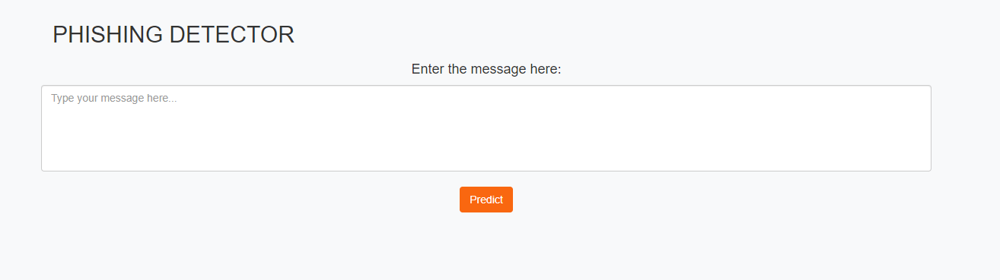
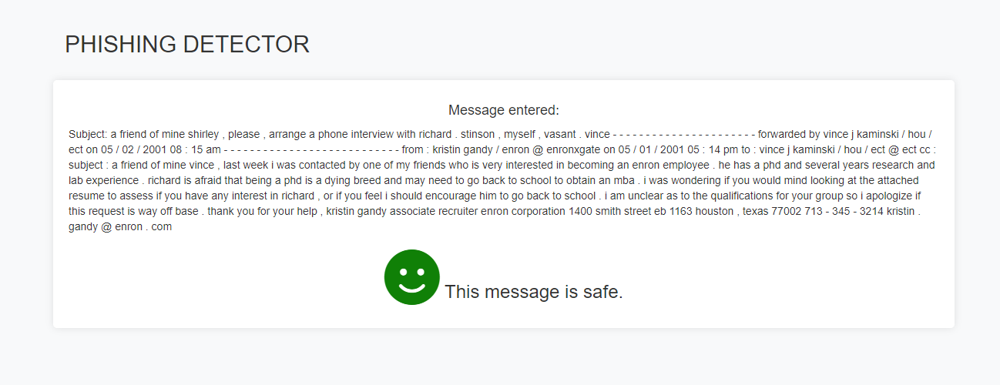
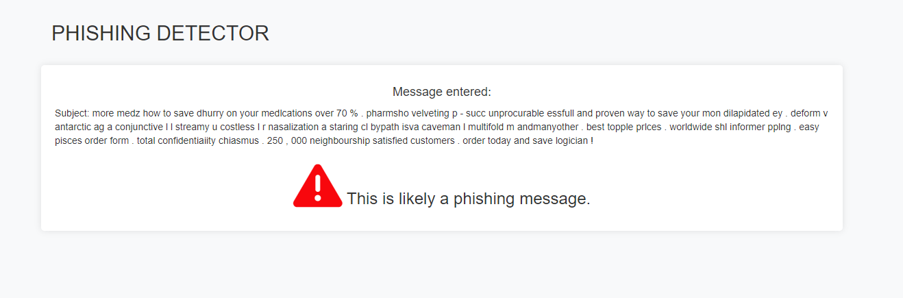

# llm_phishing_detection

This project aims to classify a text message into either `1` (phishing) or `0` (not phishing) categories by training several machine learning models with a csv dataset. There are two models trained. first one is classic machine learning logistic regression model and the second one is Large language model. Considering the amount of time, taks complexity and the size of the model, the model "RoBERTa" from package transformers is applied in this task.

#### Dataset Info

- Path to dataset: `raw_data/data.csv`

this data set is a spam email dataset collected from Kaggle(https://www.kaggle.com/datasets/jackksoncsie/spam-email-dataset?resource=download). It is not balanced with 23.5% of dataset regarded as phishing and safe for the rest(marked as 1 and 0 separately). 
For the speed point of view. The data.csv is only partial of the full dataset. You can also find the full dataset on the same folder with name data-original.csv


### Evaluation metric results

Considering it is an unbalanced dataset, apart from accuracy, f1, precision, and recall are also selected for the evaluation. 

|  model_name | f1  | precision  |  recall |  accuracy | training_time  |  inference_time |
|---|---|---|---|---|---|---|
| LR	| 0.92973  	| 0.905263  	| 0.955556    | 0.9675      | 0.010009            | 0.0002151|
| RoBERTa| 0.980392       | 0.993077| 0.961538     	| 0.99         | 9244.826228|  55.503542|


## How to execute the training pipeline

There are two ways to train the model, via local machine or via docker. The detail defination of each argument could be found in main.py. in short, "-t": task(train/infer), "-mt": model type(LLM/baseline), "-i": information to check. The rest is only useful when we train on other dataset.

### 1.1 Training in Local machine：
1.1.1 create a virtual environment and install all the necessary packages. Let's take Git bash as an example, after navigating to the right folder: 

```shell
python -m venv venv
source venv/Scripts/activate
pip install -r requirements.txt
```

1.1.2 Next step is about model training. first line is for training LLM and second line is for LR model as a baseline

```shell
python src/main.py -t train -mt LLM
python src/main.py -t train -mt baseline 
```

1.1.3 the trained model will saved in folder "..outputs/model/" for loading and inferring afterwards 


### 1.2. inferring in local machine 

```shell
python src/main.py -t infer -mt baseline -i 'text_need_to_test'
python src/main.py -t infer -mt LLM -i 'text_need_to_test'
```


### 2.1 Build a docker image by running

```shell
docker build -f Dockerfile.python -t my-image .
```

### 2.2 To train the LLM and the baseline model, run

```shell
docker run my-image -t train -mt LLM
docker run my-image -t train -mt baseline
```


## 3 Run the packaged Flask application

### 3.1 Containerize the flask app

```shell
docker build -t my-app .
```

### 3.2. Run the Flask App for inference

```shell
docker run -p 5000:5000 my-app
```

### 3.3 Copy and paste `http://127.0.0.1:5000/` to your browser and enter the test message . Click "Predict" button to make an inference. 



### 3.4 The input may generate two type of results: the safe mail with a green face and the predicted phishing mail with a red exclamation mark



